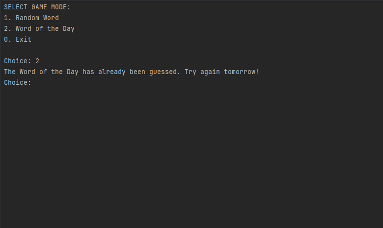

# Wordle Console Game
Wordle Console Game — це консольна версія популярної гри Wordle, написана на C++. Гравець повинен відгадати слово з 5 літер, отримуючи підказки у вигляді кольорових маркерів на буквах. 
Гра підтримує два режими: випадкове слово або слово дня.

## Особливості
- **Два режими гри**:  
  - **Випадкове слово** — випадково обране слово зі словника.  
  - **Слово дня** — статичне слово, яке змінюється щодня.
- **Підказки для гравця**:  
  - Літери на своїй позиції позначаються **великими літерами**.  
  - Літери, присутні у слові, але на іншій позиції — **малими літерами**.  
  - Літери, яких немає у слові, позначаються **зірочками**.
- **Крос-запусковий функціонал**: гра запам'ятовує, чи було відгадано слово дня, навіть після перезапуску.

## Приклади роботи
_Вставте сюди скріншоти:_  
1. **Запуск гри та вибір режиму:**  
     

2. **Процес відгадування:**  
   
   
   

4. **Відгадування слова дня:**  
     

## Принцип роботи алгоритму
1. **Завантаження слів**:  
   Програма завантажує слова зі словника (`words_database.txt`) та перевіряє їх на валідність (5 літер, лише алфавітні символи).

2. **Вибір слова**:  
   - Для **випадкового режиму** використовується генератор випадкових чисел.  
   - Для **слова дня** використовується алгоритм, який вибирає слово залежно від дня року.

3. **Підказки**:  
   - Під час введення слова гравцем, програма перевіряє кожну літеру:  
     - Літери на правильній позиції — позначаються великою літерою.  
     - Літери, що присутні, але не на своїй позиції — малою літерою.  
     - Відсутні літери позначаються зірочками.  

4. **Перезапуск гри**:  
   Гравець може перезапустити гру після завершення.

## Покриті тест-кейси
1. **Простий сценарій (успішне відгадування):**  
     
   
2. **Слово з дублікованими літерами:**  
     
   
3. **Некоректний ввід слова:**  
   - Менше або більше ніж 5 літер.  
   - Неприпустимі символи.  
    
    

4. **Відгадування слова дня:**  
   - Якщо слово дня вже відгадане, гра блокує цей режим.  
   

5. **Випадкове слово:**  
   - Гра обирає слово випадково з бази.  
    
    

## Коментарі до коду
### Основні модулі
1. **`getCurrentDay()`**:
   Отримує число яке відповідає порядковому номеру дня року, відповідно до сьогоднішньої дати.   
2. **`loadWordsFromFile()`**:  
   Завантажує слова з текстового файлу, перевіряючи їх на відповідність.  
   _Можливе покращення:_ Додати логування у разі помилок під час зчитування.

3. **`getWorldOfTheDay()`**:  
   Повертає слово дня на основі дня року.  

4. **`printResult()`**:  
   Формує підказки для гравця, враховуючи всі можливі сценарії з дублікованими літерами.  

5. **`playGame()`**:  
   Основний цикл гри, включає вибір режиму, обробку введення та логіку завершення гри.  
   _TODO:_ Додати таймер для обмеження часу на відгадування.

### Відомі проблеми
- Слова з некоректними символами у базі даних можуть бути пропущені без повідомлення про помилку.  
- Відсутність механізму для збереження кількості спроб після перезапуску гри.  

## Інструкції
1. Завантажте репозиторій
2. Запустіть .cpp у вашому середовищі Visual Studio або Raider
3. Перед запуском word_of_the_day_status.txt та words_database.txt має бути в одні папці з lesson_13.cpp
